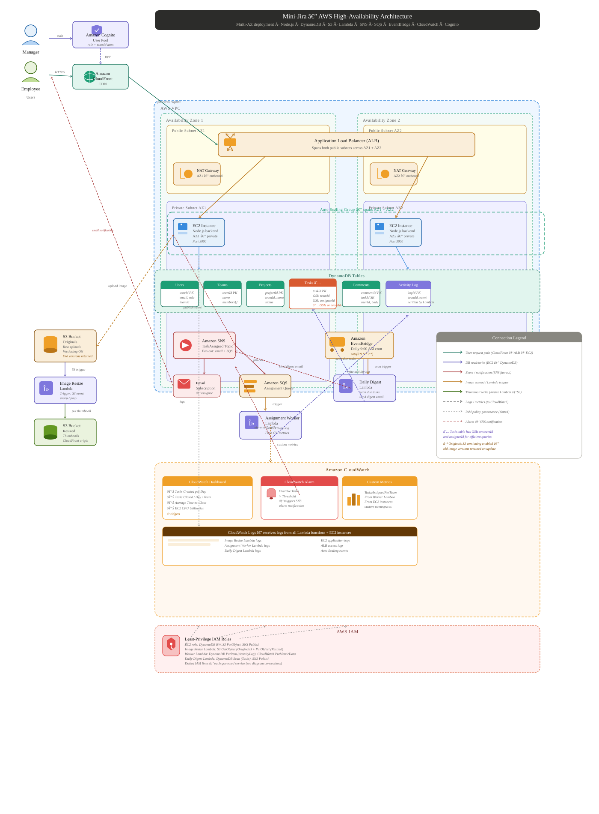

# Cloud_Project: Mini-Jira AWS Backend

This repository contains the backend code for the Mini-Jira application, built with NestJS and fully integrated with AWS (DynamoDB, S3, SNS, SQS, EventBridge, Cognito).

## Project Overview

This project is a lightweight team task-management web application (similar to Jira or Trello) fully running on AWS. The application supports multiple teams inside a company, where a manager assigns tasks to specific employees on specific teams, and each team only sees its own work. 

The system uses an event-driven architecture with AWS services (SNS, SQS, EventBridge), a Lambda-based image pipeline, and CloudWatch dashboards for monitoring. It is designed for high availability, deployed across at least two Availability Zones behind an Application Load Balancer and CloudFront.

## Architecture Diagram

Below is the detailed AWS architecture diagram showing the high-availability setup across two Availability Zones, using official AWS service icons.

> **Interactive Version:** Open [`mini_jira_aws_architecture.html`](./mini_jira_aws_architecture.html) in your browser for an interactive, zoomable version of this diagram.

## Deliverables

- **Architecture Diagram:** [`mini_jira_aws_architecture.html`](./mini_jira_aws_architecture.html) (interactive) / [`mini_jira_aws_architecture.svg`](./mini_jira_aws_architecture.svg) (preview)
- **Live Application URL:** `[Insert CloudFront Distribution URL here]`
- **Demo Video:** `[https://drive.google.com/file/d/15gnWFBfWMtdq_RKjLfFO2YqAq-TyqVQF/view?usp=sharing]`

## AWS Architecture

- **EC2 (Auto Scaling Group):** Hosts the backend across at least 2 Availability Zones.
- **Application Load Balancer:** Distributes traffic across EC2 instances and runs health checks.
- **CloudFront:** CDN for low-latency delivery of the application.
- **DynamoDB:** Stores all application data (Users, Teams, Projects, Tasks, Comments) using GSIs for team isolation.
- **S3:** Stores task image attachments (originals and resized thumbnails).
- **Lambda:** Event-driven serverless compute for image resizing, SQS assignment worker, and EventBridge daily digests.
- **SNS & SQS:** Fan-out architecture for task-assignment events, decoupling the API from background processing.
- **EventBridge:** Scheduled cron rules for daily notifications.
- **Cognito:** Manages user authentication, roles, and team membership.
- **CloudWatch:** Monitoring, custom metrics, dashboards, and alarms.

## API Endpoints Mapping & Business Rules

This document maps out all the endpoints that will be built for the Mini-Jira AWS application.
All endpoints (except those marked as **Public**) require a valid Cognito JWT Bearer token.

**Core Rule:** Security and Team Isolation are enforced strictly on the *server-side* using DynamoDB GSIs. 

### 1. Health & Debug
- **`GET /`** (Public)
  - **Purpose:** Health check for the AWS Application Load Balancer.
- **`GET /aws-test`** (Public)
  - **Purpose:** Verifies DynamoDB connection and lists tables.

### 2. Authentication
*Integrates with AWS Cognito to issue and validate JWT tokens.*
- **`POST /auth/signup`** (Public)
  - **Purpose:** Register a new user in Cognito and store their role/team mapping.
  - **Roles:** None required.
- **`POST /auth/login`** (Public)
  - **Purpose:** Authenticate a user and return the JWT Bearer tokens (IdToken, AccessToken).
  - **Roles:** None required.
- **`POST /auth/logout`**
  - **Purpose:** Calls Cognito's Global Sign-Out to revoke the user's refresh tokens across all devices.
  - **Roles:** Any authenticated user.

### 3. Users (User Management)
*Managers need to see employees to assign tasks. Admins assign users to teams and manage roles.*
- **`GET /users/me`**
  - **Purpose:** Fetch the current authenticated user's profile, role, and team (essential for the frontend to know what UI to render on load).
  - **Roles:** Any authenticated user.
- **`GET /users/org-chart`**
  - **Purpose:** Fetch a hierarchical tree of the organization (Admins -> Managers -> Teams -> Employees) to render an interactive Org Chart in the frontend.
  - **Roles:** Any authenticated user (Employees see a restricted view, Managers/Admins see the full tree).
- **`GET /users`**
  - **Purpose:** List users. Managers can see all users. Employees can only see users within their own team.
  - **Roles:** Any authenticated user.
- **`GET /users/team/:teamId`**
  - **Purpose:** Fetch all employees belonging to a specific team.
  - **Roles:** `Manager`, `Admin`
- **`PUT /users/:userId/profile`**
  - **Purpose:** Allow a user to update their own profile details (e.g., name, avatar, phone number).
  - **Roles:** Any authenticated user (can only update themselves).
- **`PUT /users/:userId/team`**
  - **Purpose:** Assign an employee to a specific team.
  - **Roles:** `Admin`
- **`PUT /users/:userId/role`**
  - **Purpose:** Change a user's role (e.g., Employee -> Manager).
  - **Roles:** `Admin`
- **`POST /users/admin`**
  - **Purpose:** Securely create or elevate an account to Admin status.
  - **Roles:** `Admin` (or secure backend script).
- **`DELETE /users/:userId`**
  - **Purpose:** Deactivate or delete an employee from the system.
  - **Roles:** `Admin`

### 4. Teams
*Employees belong to a specific team. Managers oversee teams.*
- **`POST /teams`**
  - **Purpose:** Create a new team.
  - **Roles:** `Admin`
- **`GET /teams`**
  - **Purpose:** List teams based on role.
    - *Filter:* Employees only fetch their *own* team. Managers and Admins fetch *all* teams.
  - **Roles:** Any authenticated user.
- **`GET /teams/:teamId`**
  - **Purpose:** Get a specific team. Employees can only fetch their own team's ID.
  - **Roles:** Any authenticated user.
- **`DELETE /teams/:teamId`**
  - **Purpose:** Delete a team.
  - **Roles:** `Admin`

### 5. Projects
*Projects are assigned to specific users or teams.*
- **`POST /projects`**
  - **Purpose:** Create a new project.
  - **Roles:** `Manager`, `Admin`
- **`GET /projects`**
  - **Purpose:** List projects based on role.
    - *Filter:* Employees and Managers only fetch projects assigned to them. Admins fetch *all* projects.
  - **Roles:** Any authenticated user.
- **`GET /projects/:projectId`**
  - **Purpose:** Get details of a project. Server checks if user is assigned or is Admin.
  - **Roles:** Any authenticated user.
- **`PUT /projects/:projectId`**
  - **Purpose:** Update a project.
  - **Roles:** `Manager`, `Admin`
- **`DELETE /projects/:projectId`**
  - **Purpose:** Delete a project.
  - **Roles:** `Manager`, `Admin`
- **`POST /projects/:projectId/members`**
  - **Purpose:** Assign an employee or a team to a project.
  - **Roles:** `Manager`, `Admin`
- **`DELETE /projects/:projectId/members/:userId`**
  - **Purpose:** Remove an employee from a project.
  - **Roles:** `Manager`, `Admin`

### 6. Tasks (The Core Engine)
*Tasks are assigned to employees on specific teams. Contains S3 image integration and SNS triggers.*
- **`GET /tasks/upload-url`**
  - **Purpose:** Generates a secure, temporary S3 Presigned URL. The frontend uses this to upload heavy images directly to AWS S3, keeping the backend highly performant.
  - **Roles:** Any authenticated user.
- **`POST /tasks`**
  - **Purpose:** Create a task and link an S3 image key (if uploaded). Emits `TaskAssigned` to SNS if assigned.
  - **Roles:** `Manager`
- **`GET /tasks`**
  - **Purpose:** List tasks based on role. Supports query filters (e.g., `?status=IN_PROGRESS`, `?assigneeId=123`, `?projectId=456`).
    - *Filter (CRITICAL):* If `Employee`, it strictly returns tasks using the DynamoDB GSI where `teamId` equals their own team ID. `Manager` bypasses this filter and sees all tasks.
  - **Roles:** Any authenticated user.
- **`GET /tasks/:taskId`**
  - **Purpose:** Get a specific task. If Employee, backend strictly validates that the task's `teamId` matches the employee's `teamId`. An employee cannot fetch a task from another team even if they guess the ID.
  - **Roles:** Any authenticated user.
- **`PUT /tasks/:taskId`**
  - **Purpose:** Update a task completely. Handles updating the S3 image attachment.
  - **Roles:** `Manager`
- **`PATCH /tasks/:taskId/status`**
  - **Purpose:** Quick-update for Kanban boards (e.g., drag and drop from To Do -> In Progress). If the status changes, an entry is written to the **Audit Log**.
  - **Roles:** `Manager`, `Employee` (restricted to own team).
- **`PATCH /tasks/:taskId/assignee`**
  - **Purpose:** Quick-update to reassign a task. Emits `TaskAssigned` to SNS.
  - **Roles:** `Manager`
- **`GET /tasks/:taskId/history`**
  - **Purpose:** Fetch the specific audit log/activity feed for a single task (who changed it, when, and what comments were added) to display in the task's timeline UI.
  - **Roles:** Any authenticated user.
- **`DELETE /tasks/:taskId`**
  - **Purpose:** Deletes the task from DynamoDB and deletes the corresponding image from S3.
  - **Roles:** `Manager`
- **`GET /tasks/export/csv`**
  - **Purpose:** Generates and returns a downloadable CSV file containing all tasks matching the user's current filters (highly requested enterprise feature for reporting).
  - **Roles:** `Manager`, `Admin`

### 7. Comments
*Comments on a specific task.*
- **`POST /comments`**
  - **Purpose:** Add a comment to a task. Enforces team isolation logic.
  - **Roles:** Any authenticated user.
- **`GET /comments/:taskId`**
  - **Purpose:** List all comments for a specific task. Enforces team isolation logic.
  - **Roles:** Any authenticated user.
- **`PUT /comments/:commentId`**
  - **Purpose:** Edit an existing comment. Users can only edit their own comments.
  - **Roles:** Any authenticated user.
- **`DELETE /comments/:commentId`**
  - **Purpose:** Delete a comment. Users can delete their own comments, Managers can delete any comment.
  - **Roles:** Any authenticated user.

### 8. Activity / Audit Logs
*Logs system actions for tracking and security compliance. Populated asynchronously via SQS Worker.*
- **`GET /audit-logs`**
  - **Purpose:** Fetches the activity log. Must support heavy query parameters for filtering: `?startDate=...`, `?endDate=...`, `?userId=...`, `?actionType=TASK_UPDATED`.
  - **Roles:** `Manager`, `Admin`
- **`GET /audit-logs/export`**
  - **Purpose:** Generates a downloadable CSV of system logs for security auditing and SOC2 compliance reporting.
  - **Roles:** `Admin` (Highly restricted).
- **`GET /users/:userId/activity`**
  - **Purpose:** Fetches a specific user's recent activity feed (e.g., "John changed Task-1 to Done 5 mins ago"). Used for user profile pages.
  - **Roles:** Any authenticated user.

### 9. Metrics, Dashboard & Visualizations
*Feeds the frontend dashboard with critical statistics and graphing data.*
- **`GET /metrics/dashboard/summary`**
  - **Purpose:** Pulls top-level KPI numbers (total tasks, open vs closed ratio, EC2 CPU utilization).
  - **Roles:** `Manager`, `Admin`
- **`GET /metrics/visualizations/time-series`**
  - **Purpose:** Returns historical data formatted specifically for Frontend Line/Bar charts (e.g., `[{ date: '2026-05-01', created: 10, closed: 15 }]`).
  - **Roles:** `Manager`, `Admin`
- **`GET /metrics/visualizations/distribution`**
  - **Purpose:** Returns categorical data formatted for Pie/Donut charts (e.g., Task counts broken down by `Status`, `Priority`, or `Assignee`).
  - **Roles:** `Manager`, `Admin`
- **`GET /metrics/visualizations/burndown`**
  - **Purpose:** Calculates the agile burndown chart trajectory for a specific project or sprint.
  - **Roles:** `Manager`, `Admin`

### 10. Global Search
*Omnibar search capability.*
- **`GET /search`**
  - **Purpose:** Global search across Tasks, Projects, and Comments (e.g., `?q=login bug`). Enforces team-isolation constraints on the results!
  - **Roles:** Any authenticated user.

### 11. Notifications (In-App)
*Powers the frontend "Bell Icon" for user alerts.*
- **`GET /notifications`**
  - **Purpose:** Fetch in-app notifications for the authenticated user (e.g., "You were assigned Task-123"). Supports `?unreadOnly=true`.
  - **Roles:** Any authenticated user.
- **`PUT /notifications/:id/read`**
  - **Purpose:** Mark a specific notification as read to decrease the bell icon counter.
  - **Roles:** Any authenticated user (restricted to own notifications).
- **`PUT /notifications/read-all`**
  - **Purpose:** Mark all of the user's notifications as read instantly.
  - **Roles:** Any authenticated user.
